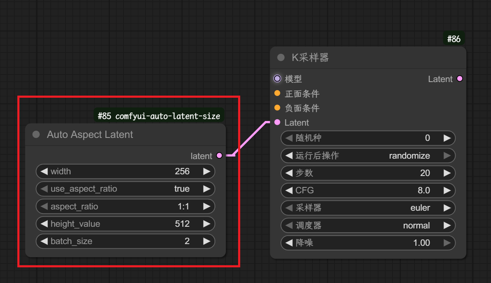

# Auto Aspect Latent Generator - 使用说明

## 📖 简介

这个项目提供了一个 ComfyUI 自定义节点，用于生成指定尺寸的潜在（Latent）图像，并支持根据宽高比自动调整尺寸。它可以帮助用户更灵活地控制生成图像的比例，这对于不同平台或展示需求下的内容创作至关重要。

## ✨ 功能特性

- **灵活的宽度设置**  
  用户可以自定义生成潜在图像的宽度，范围从 64 到 4096 像素。

- **宽高比自动调整**  
  - 可以选择开启宽高比自动调整功能。  
  - 支持多种预设宽高比，包括：`1:1`（正方形）、`4:3`（标准显示器）、`16:9`（宽屏）、`9:16`（手机竖屏）、`3:4`、`2:3`、`3:2`、`1:2`、`2:1`。  
  - 当选择自动调整时，高度将根据设定的宽度和选择的宽高比自动计算。

- **自定义高度**  
  当不使用宽高比自动调整时，用户可以手动设置高度，范围同样是 64 到 4096 像素。

- **批量生成**  
  支持批量生成潜在图像，用户可以设置生成数量，范围从 1 到 99。

- **ComfyUI 集成**  
  作为 ComfyUI 的自定义节点，无缝集成到工作流中，方便用户拖拽使用。

## 🛠️ 安装

### Windows 平台

- **方法 1：** 将本项目克隆到 ComfyUI 目录下的 `custom_nodes` 文件夹中：

  ```bash
  git clone https://github.com/kaipard/comfyui-auto-latent-size
  ```

- **方法 2：** 将本项目下载并解压到 ComfyUI 的 `custom_nodes` 文件夹中。

启动或重启 ComfyUI 即可。

## 🚀 使用方法

在 ComfyUI 界面中，通过 "Add Node" 菜单，在 `latent/generator` 分类下找到 **Auto Aspect Latent** 节点并添加。

> *图片描述：如何在 ComfyUI 的节点菜单中找到并添加 “Auto Aspect Latent” 节点。*

### 🎛️ 节点参数

| 参数               | 类型    | 说明 |
|--------------------|---------|------|
| `width`            | int     | 输出潜在图像的宽度（像素） |
| `use_aspect_ratio` | enum    | 若选择 `"true"`，将根据比例自动计算高度；选择 `"false"` 时，需手动输入 `height_value` |
| `aspect_ratio`     | enum    | 当 `use_aspect_ratio` 为 `"true"` 时，选择预设的宽高比 |
| `height_value`     | int     | 当不使用比例模式时，手动设置的高度（像素） |
| `batch_size`       | int     | 批量生成潜在图像的数量 |

> *图片描述：展示 “Auto Aspect Latent” 节点的详细参数设置界面。*

## 🧪 示例工作流

以下是一个部分 ComfyUI 工作流示例，展示了如何使用 `Auto Aspect Latent` 节点：

1. 添加 `Auto Aspect Latent` 节点；
2. 将其 `latent` 输出连接到需要潜在图像输入的模型（例如采样器）；
3. 根据需求调整节点参数，如 `width` 和 `use_aspect_ratio`。

> *图片描述：一个使用 “Auto Aspect Latent” 节点生成潜在图像并连接到采样器的工作流示例。*



## 👨‍💻 开发者信息

- `__init__.py`：ComfyUI 节点注册文件，定义了节点类映射和显示名称；
- `auto_aspect.py`：核心逻辑文件，包含 `AutoAspectLatent` 类，负责潜在图像的生成和尺寸计算。

---

# Auto Aspect Latent Generator - English Version

## 📖 Introduction

This project provides a custom **ComfyUI** node for generating latent images of specified dimensions, with support for automatic resizing based on aspect ratio. It helps users flexibly control the aspect ratio of generated images, which is crucial for content creation across different platforms or display requirements.

## ✨ Features

- **Flexible Width Setting**  
  Users can customize the width of the generated latent image, ranging from 64 to 4096 pixels.

- **Automatic Aspect Ratio Adjustment**  
  - Ability to enable automatic aspect ratio adjustment.  
  - Supports various preset aspect ratios, including: `1:1` (square), `4:3` (standard monitor), `16:9` (widescreen), `9:16` (mobile portrait), `3:4`, `2:3`, `3:2`, `1:2`, `2:1`.  
  - When automatic adjustment is enabled, the height will be calculated based on the set width and the selected ratio.

- **Custom Height**  
  When not using automatic aspect ratio adjustment, users can manually set the height (64 to 4096 pixels).

- **Batch Generation**  
  Generate multiple latent images by setting `batch_size` from 1 to 99.

- **ComfyUI Integration**  
  Seamlessly integrates into your ComfyUI workflow via a drag-and-drop node interface.

## 🛠️ Installation

### Windows Platform

- **Method 1:** Clone this project into the `custom_nodes` folder of ComfyUI:

  ```bash
  git clone https://github.com/kaipard/comfyui-auto-latent-size
  ```

- **Method 2:** Download and extract this project into the `custom_nodes` folder of ComfyUI.

Start or restart ComfyUI after installation.

## 🚀 Usage

In the ComfyUI interface, go to the "Add Node" menu and find **Auto Aspect Latent** under the `latent/generator` category.

> *Image Description: How to find and add the "Auto Aspect Latent" node in the ComfyUI node menu.*

### 🎛️ Node Parameters

| Parameter           | Type   | Description |
|---------------------|--------|-------------|
| `width`             | int    | Width of the output latent image (pixels) |
| `use_aspect_ratio`  | enum   | When `"true"` is selected, height will be auto-calculated from width and `aspect_ratio`; if `"false"`, you must enter `height_value` |
| `aspect_ratio`      | enum   | Preset aspect ratio, used when `use_aspect_ratio` is `"true"` |
| `height_value`      | int    | Custom height value when ratio is disabled (pixels) |
| `batch_size`        | int    | Number of latent images to generate |

> *Image Description: Displaying the detailed parameter setting interface of the "Auto Aspect Latent" node.*

## 🧪 Example Workflow

Here's a sample partial ComfyUI workflow to demonstrate using the `Auto Aspect Latent` node:

1. Add the `Auto Aspect Latent` node;
2. Connect its `latent` output to a model that accepts latent input (e.g., a sampler);
3. Adjust parameters like `width` and `use_aspect_ratio` as needed.

> *Image Description: A workflow example using the "Auto Aspect Latent" node to generate latent images and connect to a sampler.*


## 👨‍💻 Developer Information

- `__init__.py`: ComfyUI node registration file, defines node mappings and display names.
- `auto_aspect.py`: Core logic, includes the `AutoAspectLatent` class for latent generation and dimension calculation.
